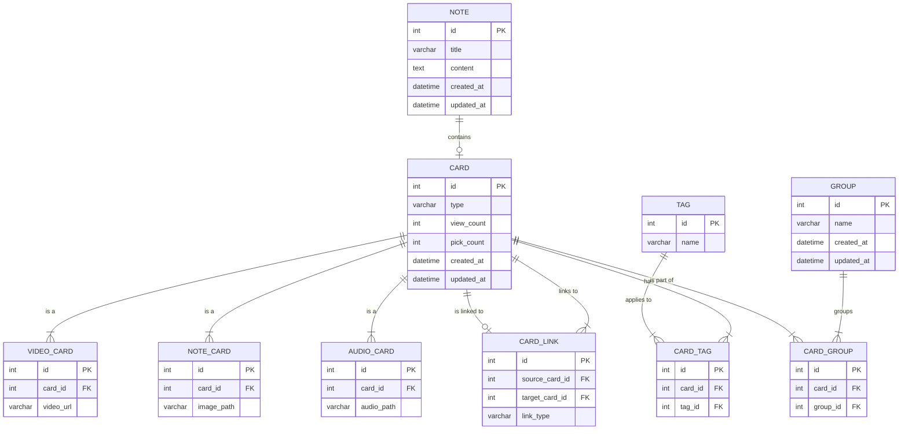

# Prompt
I have an app that has following the features:
- view/add/edit/delete note
- the app has components structure like the below:
  - Subjects (eg: Calculus) contains topics (eg: limit, continually)
  - each card must
- there are different type of cards, with different functionality
  - video card, need to store video url
  - note card, need to store image path
  - audio card, need to store audio path
- the app has list of tags, which can be put in cards, and has the feature to group cards
- the cards can be link/map with each other
- feature to monitor how many time the card has been view, pick, ...
- 

Design me a SQL database using markdown mermaid for the above features.
put the response in ```` ... ````

# Architecture


