# Prompt
I have an app that contains following components
- There are two type of components, default component, and users' components
- structure of components: Subjects contain topics, topics container cards
- in each card can contains one or many of following components
  - audio
  - video
  - md text
  - math entities (latex)
  - mermaid diagrams
- cards should have titles
- there 3 type of relations, "is in", "depend", and "related", for example topics is in a subject. cards is in topic, a topic can be depended on or related to another topic

Make me ER diagram using  mermaid for the above features, having example of each field
put the response in ````mermaid ... ````

# RBAC 

# Mermaid Diagram

```mermaid

graph LR
    classDef A fill:#FFDDC1,stroke:#333,stroke-width:2px; 
    classDef B fill:#D5AAFF,stroke:#333,stroke-width:2px;
    classDef C fill:#B0E57C,stroke:#333,stroke-width:2px;
    Field --> |contains many| Subject
    Subject --> |contains many| Topic
    Topic --> |contains many| Sub-Topic
    Sub-Topic --> |contains many| Concept
    Section --> |contains many| Card["Card: It should be <br>self-explanatory, requiring <br>no additional explanation."]
    
    Collection --> |contains many| Book
    Book --> |contains many| Chapter
    Chapter --> |contains many| Section
    Page --> |contains list of| Card
    subgraph Component
          direction TB
          md_text
          audio
          video
          mermaid
          QA["Exercise/Quiz"]
    end
    %% Relation
    Card --> |contains one or more | Component
    Concept --> |using one | Page
    Sub-Topic --> |using one| Section
    Topic --> |using one| Chapter
    Field --> |using one| Collection
    Subject --> |using one| Book

    subgraph Versions
          direction TB
          Easy["Easy Version"]
          Medium["Medium Version"]
          Difficult["Difficult Version"]
    end
    Card --> |has| Versions

    %% Put color
    class Field,Subject,Topic,Sub-Topic,Concept A; 
    class Collection,Book,Chapter,Section,Page,Card,Component,md_text,audio,video,mermaid,QA C;

```

