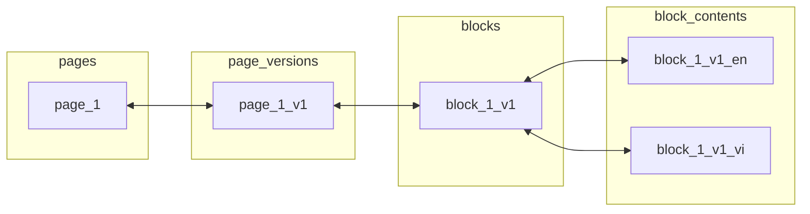
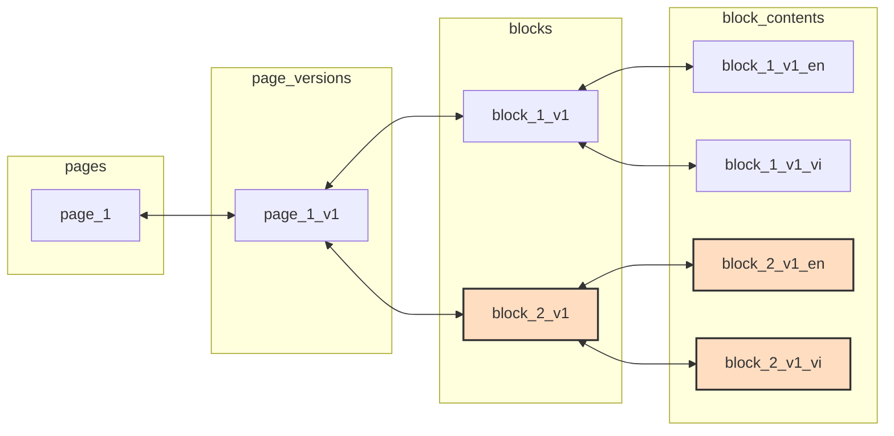
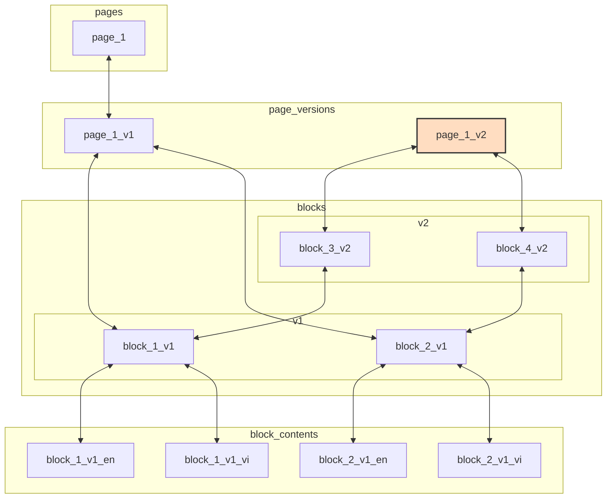

# Sample data

# New Block

# New created Version

## New version: clone content of latest version by s
## Make a new language
 in a version will clone all the block content of the source language, A page-version languages must have same number of blocks and orders
## New block 
Adding new block to a language, it will appear in other language as well